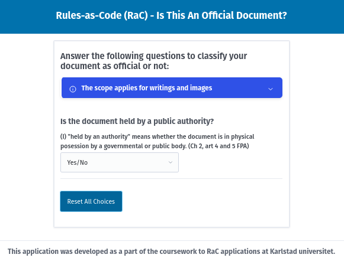
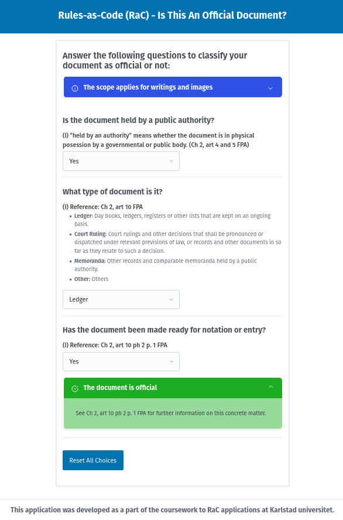

# Rules-as-Code (RaC) - Is This A Public Document?

[Available as a static page on GitHub](https://jensilo.github.io/RaC-Official-Document/)

This project is a web application that helps determine if a document is considered "public" under the Swedish Freedom of the Press Act (FPA). It guides the user through a series of questions based on the FPA to classify a document.



Example usage of the application:



## Prerequisites

- [Node.js](https://nodejs.org/) (version `^20.19.0` or `>=22.12.0`)

## Getting Started

1.  **Install dependencies:**

    ```bash
    npm install
    ```

2.  **Run the development server:**

    ```bash
    npm run dev
    ```

    The application will be available at `http://localhost:5173` (the default Vite port).

## Available Scripts

-   `npm run dev`: Starts the development server.
-   `npm run build`: Builds the application for production.
-   `npm run preview`: Previews the production build.
-   `npm run test:unit`: Runs unit tests using Vitest.
-   `npm run lint`: Lints the source code using ESLint.
-   `npm run format`: Formats the source code using Prettier.